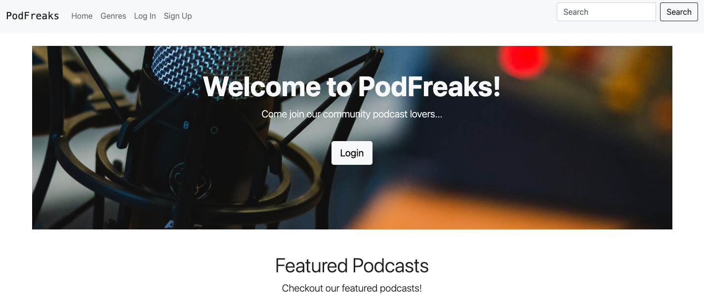
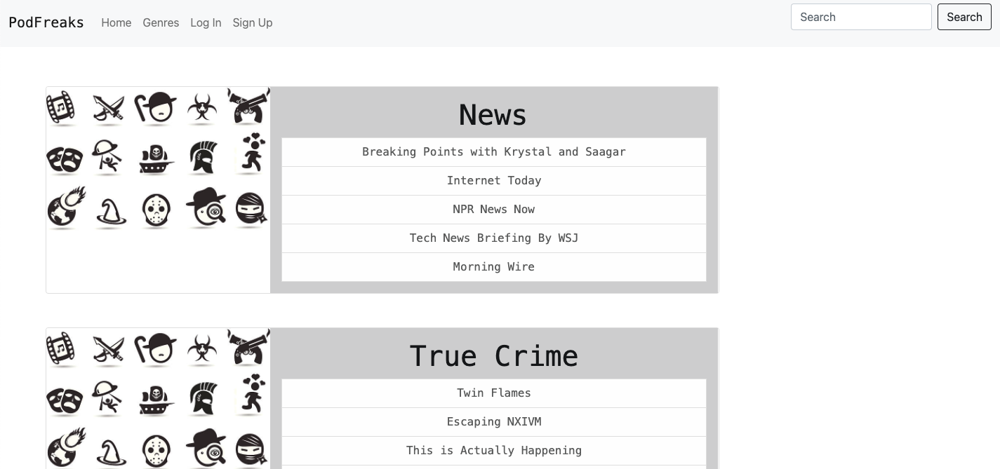

  

<h1 align="center">PodFreaks</h1>

## Table of Contents

* [Description](#description)
* [Built With](#builtwith)
* [Website](#website)
* [Presentation](#presentation)
* [Contribution](#contribution)

## Description

PodFreaks is an easy to use podcast forum where users can sign-up for an account and review various podcasts. The users have the abliity to explore podcasts by genres, leave comments, and see other users comments. This app allows users to join a social community for podcast lovers. This application has been deployed in Heroku.

## Built With

* JavaScript
* dotenv
* express
* mysql2
* Sequelize
* nodemon
* bcrypt
* express-session
* express-handlebars
* connect-session-sequelize
* date-and-time

## Website

[PodFreak Link](https://evening-tor-85614.herokuapp.com/).

</img>

</img>

## Presentation
[PodFreaks](https://docs.google.com/presentation/d/1IWttKVyo4UAwfv6SM7oHBSZzRSTGJ6eG1wAbLB83t14/edit#slide=id.p) 

## Contribution

* Nicole Barranca
* Chloe Yarborough
* Alen Dunn
* Robert Platzer
* Nico D'Anna
